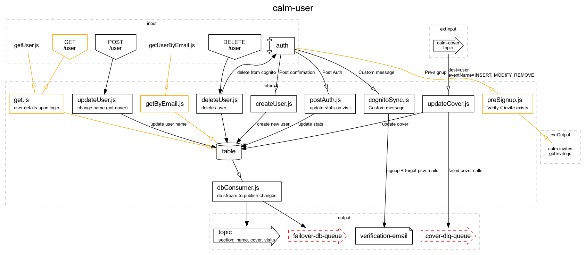

# Dependency graph
Service to create visual dependency graphs of services setup.

## Getting started
Install npm package
```
npm install stack-graph
```
Create a stackdef folder and stackdef file
```
└───stackdef/
    └───stackdef.js
```
The stackdef file's `export default` should be a javascript object containing a [stack definition](#stack-definition-format)

## Running locally
Install the [graphviz](https://graphviz.org/download/) locally, e.g. with Homebrew
```
brew install graphviz
```

Local use with a `index.js` file 
```javascript
const { resolve } = require('path')
const { localGraph, localVerify } = require('stack-graph')

const currentPath = resolve('./')

async function main() {
    const result = await localGraph({
        inputFilename: 'stackdef.js',
        outputFilename: 'service-map',
        graphFormat: 'png', // or 'svg'
        path: currentPath // required
    })
    console.log(result.valid) // true (or errors)

    const validationResult = await localVerify({
        inputFilename: './stackdef.js',
        path: currentPath // required
    })
    console.log(result.valid) // true (or errors)}
}

main()
```

The function can be called through node function, which takes arguments as well:
```bash
node index.js -i stackdef.js -o stackdef -e png -p "/Users/wintvelt/DEV/stack-graph/stackdef"
```
Parameters are:
- `-i` stackdef input filename
- `-o` output filename (without extension)
- `-e` export format (png is default, could be svg too)
- `-p` path where input can be found and output will be stored

Function will evaluate args in`index.js` file first, then check parameters passed in through node call.

## Functions of this service
Converts a [stack definition](#stack-definition-format) object (of a single service) to 
- a `.dot` formatted text string fodc, containing internal entities and event flow (for rendering with [graphviz](https://graphviz.org/))
- a `.json` file with the raw, cleaned up structure of nodes and edges
- a `.md` file containing all the todos needed to build the code according to the stackdef structure
- a `.png` or `.svg` file with a picture of the stack stucture

If you update the stackdef source and run the function again
- the `.md` file with update: any items that were checked in the old file, will also remain checked in the new file
- all other files will be overwritten

## Stack definition format
Basic structure of stack definition is
```javascript
// stackdef.js
module.exports = {
    serviceName: "spqr-user",
    nodes: []
}
```
In this structure, `nodes` are an array of objects. Each object is a node.
A typical node object has following structure
```javascript
{
    name: "createUser.js",
    type: "function",
    subs: [], // only for functions or queues
    pubs: [], // only for functions
    queries: [], // only for functions
    description: "add non-obvious notes" // optional
    cluster: "internal", // optional, can also be "input" or "output"
}
```
`name` or `type` must be provided, where options are
- `type`: `function|table|auth|bucket|topic|queue|email|schedule`
- `name` can be anything, with following remarks
    - function type names should end in `.js`
    - if the name ends in type, e.g. `visit-topic`, then type does not need to be provided. Because type can be derived from the name
    - if the name is a clear API - e.g. `GET /user` - then the API type will be inferred

API nodes - input to many services - can optionally be setup in a different way:
```javascript
{
    path: '/',
    method: 'GET' // or any other valid http method
    type: 'API' // optional, does not need to be provided
}
```

Best practice is to define nodes only for functions. All other nodes will then be derived from the dependencies.

Use `pubs`, `subs` and `queries` to make connections between nodes. Each item can be a name string (make sure that the type can be derived from the name, e.g. `POST /user` (API), `createUser.js` (another function), `table` (table)
Or an item can be an object
``` javascript
{
    name: 'POST /user',
    serviceName: 'external-service', // optional, add if the dependency is to external item
    async: true, // optional for pub, use to indicate if connection is async
    isQuery: true, // optional for pub, use to indicate if connection is a query (read not write)
    filters: {}, // optional for pubs and subs
    description: "add non-obvious notes" // optional
}
```
Filters are relevant for pub or sub to topics:
- for `pub` they should include the relevant attributes added to topic message, e.g. `{ sections: "profile, photo, address" }`
- for `sub` they should include the relevant attributes to filter messages for this sub, e.g. `{ eventName: "MODIFY", sections: "profile" }`

Query dependencies get a different color.
Async calls are indicated by an open arrow.

If a node or dependency item has the string `dlq` (for dead letter queue) in its name, the node will get a different layout. You would want to monitor these from somewhere else.

## Example
The following `stackdef.js` definition:
```javascript
module.exports = {
    serviceName: "calm-user",
    nodes: [
        {
            name: "getUser.js", cluster: "input",
            queries: ["table"]
        },
        {
            name: "getUserByEmail.js", cluster: "input",
            queries: ["table"]
        },
        {
            name: "updateCover.js",
            subs: [{
                serviceName: "calm-cover", name: "topic",
                filters: { dest: "user", eventName: "INSERT, MODIFY, REMOVE" }
            }],
            pubs: [
                { name: "table", description: "update cover" },
                { name: "cover-dlq-queue", description: "failed cover calls" },
            ]
        },

        {
            name: "createUser.js",
            eventName: "INSERT",
            pubs: [
                { name: "table", description: "create new user" },
            ],
            subs: [
                { name: "auth", description: "Post confirmation" },
            ],
        },
        {
            name: "updateUser.js",
            description: "change name (not cover)",
            eventName: "MODIFY",
            pubs: [
                { name: "table", description: "update user name" },
            ],
            subs: [
                "POST /user",

            ]
        },
        {
            name: "deleteUser.js",
            description: "deletes user",
            eventName: "REMOVE",
            pubs: ["table", { name: "auth", description: "delete from cognito" }],
            subs: ["DELETE /user"]
        },
        {
            name: "cognitoSync.js",
            description: "Custom message",
            pubs: [
                {
                    name: "verification-email",
                    description: "signup + forgot psw mails",
                },
            ],
            subs: [{ name: "auth", description: "Custom message" }],
        },
        {
            name: "preSignup.js",
            description: "Verify if invite exists",
            subs: [{ name: "auth", description: "Pre-signup", isQuery: true }],
            queries: [{ serviceName: "calm-invites", name: "getInvite.js" }]
        },
        {
            name: "postAuth.js",
            description: "update stats on visit",
            pubs: [{ name: "table", description: "update stats" }],
            subs: [{ name: "auth", description: "Post Auth" }],
        },
        {
            name: "dbConsumer.js",
            description: "db stream to publish changes",
            subs: ["table"],
            pubs: [{ name: "topic", filters: { section: "name, cover, visits" } }],
        },
        {
            name: "get.js",
            description: "user details upon login",
            subs: ["GET /user"],
            queries: ["table"],
        },
    ]
}
```

Will generate this image:
